<div align="center">

# ✦ Content Engine

**AI social-content platform — two products, one engine.**

*Creators* turn a topic into a branded, publish-ready post.
*Businesses* turn their own release notes & changelogs into fact-checked social content — with a human always in the loop.

<p>
  
  
  
  
  
  <a href="https://github.com/Dev-In-Crypt/InstaContentEngine/actions/workflows/ci.yml">
    
  </a>
  
</p>

<p>
  <a href="#-the-idea">Idea</a> ·
  <a href="#-for-creators">Creators</a> ·
  <a href="#-for-business">Business</a> ·
  <a href="#-reels-studio">Reels</a> ·
  <a href="#-accuracy-measured">Accuracy</a> ·
  <a href="#-quick-start">Quick start</a> ·
  <a href="#%EF%B8%8F-architecture">Architecture</a> ·
  <a href="#-api-overview">API</a> ·
  <a href="#-status--roadmap">Status & Roadmap</a>
</p>

</div>

---

## 💡 The idea

Most AI content tools generate *plausible* posts. Content Engine is built around two harder promises:

1. **On-brand, not generic** — every tenant has a brand identity (voice, niche, palette, logo, per-slide style) that flows through text *and* visuals. Agencies manage **multiple brands under one login**.
2. **True, not just fluent** — the Business product starts from a company's **own public sources** (GitHub releases, RSS, changelog pages), selects what's genuinely newsworthy with **explainable rules (no ML, no background LLM spend)**, drafts *grounded* posts, and **fact-checks every claim against the source** before a human approves it. Nothing auto-publishes.

One codebase, one engine underneath. A single login switches between the two experiences (**🎨 Creators ↔ 🏢 Business** in the header). Bring-your-own-keys: tenants store their own provider keys (encrypted at rest) and pay their providers directly.

**Try it without signing up** — the landing page demo takes any public repo/changelog URL and returns a lead card + a grounded draft in seconds.

---

## 🎨 For Creators

| | Feature |
|---|---|
| 📝 | **4-step wizard** — topic → settings → SSE-streamed generation → preview & edit. Platform toggle **Instagram / X**, length tiers, per-post presets, additional instructions |
| 🖼 | **Branded 1080×1350 cards** — niche box, translucent description box, logo, editable per-slide overlays (Apply / Reset), per-slide **Replace / Upload**, own-photo posts with drag-reorder |
| 🗣 | **Brand voice & profile** — presets or custom voice, niche/audience/brand name; prefills every generation |
| 🐦 | **X modes** — single post, **thread** (auto reply-chain), long post (X Premium); hashtags exactly once, markdown stripped |
| 🔍 | **Web-grounded text** (OpenRouter `:online`) with a **References** panel; SEO keywords separate from hashtags |
| 📅 | **Plan-a-week** — one click drafts a week of topics; calendar with content-pillar mix & "what to post today" |
| ⏰ | **Scheduling** — APScheduler publishes on time, 24/7 in cloud even with your PC off |
| 📊 | **Insights** — reach / likes / comments / saves snapshots from the Graph API; live LLM **cost badge** per tenant |
| 🏷 | **Agency multi-brand** — create client brands, switch in the header; posts, calendar and feed are scoped per brand |

## 🏢 For Business

The pipeline: **sources → leads → drafts → approval → journal → analytics.**

| | Feature |
|---|---|
| 🔗 | **Sources** — connect public links (GitHub releases, RSS, changelog pages). Hourly polling is **rules-only**: zero background LLM spend |
| 📰 | **Leads feed** — every item scored *worthy / weak* with a **one-line human-readable reason**; duplicates dropped; dev-channel pre-releases & fixes-only patches demoted; ⚠️ **bad-news detector** pauses celebration posts |
| ✍️ | **Grounded drafts** — one click turns a lead into a post written *only from the source*; digest mode bundles several leads; per-network IG / X text |
| ✅ | **Claim check** — every factual claim is verified against the source; *"confirmed" survives only if the evidence is literally in the source text*. Brand rules (forbidden phrases, required disclaimers) enforced deterministically |
| 👤 | **Human-in-the-loop** — draft → in review → approved → published; **approve is blocked** while brand rules are violated; a `workspace` post can only publish from *approved* |
| 📋 | **Audit journal** — every approval records the AI draft vs the human's edits, who и when; **CSV / JSON export** |
| 🛡 | **Publishing guards** — frequency caps (max per day/week), sensitive-lead confirmation |
| 📈 | **Source analytics** — per-source funnel *(leads → worthy → drafts → approved / published + conversions)*, ranked "which source posts best" |
| 🚪 | **No-signup demo** — `POST /api/demo/from-url`, hard rate-limited, runs on the app's own key |

## 🎬 Reels studio

From silent slideshow to a produced vertical video — all local ffmpeg, **no GPU, no heavy models**:

| Stage | What you get |
|---|---|
| 🎞 Base | Ken Burns 1080×1920 slideshow from the post's slides, overlays burned in |
| 🎙 **Voiceover** | LLM writes one narration segment per slide → **ElevenLabs** speaks it (your key) → each slide lasts exactly its segment → ALL-CAPS **subtitles** timed to the voice, burned via libass |
| 🎥 **Stock b-roll** | Each segment swaps to a real **Pexels video** (same key as stock photos), auto-cropped to 9:16 with rotating pan; a **vision judge** (cheap model on your OpenRouter key) checks the frames actually match the narration — fail-open, per-segment fallback to slides |
| 🎵 **Music** | Upload **your own** track — it loops quietly and **auto-ducks under the voice** (sidechain compression) |
| 🪧 **Cover** | Slide 1 shows for the first 0.5 s (branding flash) — voice & subs stay perfectly aligned |
| ✨ **Transitions** | Crossfades between b-roll clips, **sync-preserving** (timeline matches the voice second-for-second) |
| 📤 Publish | Preview, download MP4, or publish the Reel to Instagram (cloud) |

## 🔬 Accuracy, measured

The Business pipeline was validated on **real data**, not vibes:

| Gate | Method | Result |
|---|---|---|
| **Factual accuracy** *(blocking)* | 50 real drafts, every "confirmed" claim hand-checked against its source | ✅ **0 / 262** invented facts marked confirmed |
| **Selection precision** | 110 real source items through the selector, hand-labeled | ✅ junk **7.7 %**, missed **9.4 %** (target < 20 % each) |
| Blind quality | topic-post vs lead-post, blind judge panel | ✅ lead-based post preferred **10/10** (proxy run) |

The key guard is deterministic: a claim can only be *confirmed* if its quoted evidence literally appears in the source — a hallucinated confirmation cannot survive, no matter what the model says.

---

## 🚀 Quick start

### ☁️ Cloud (multi-tenant SaaS)

```bash
git clone https://github.com/Dev-In-Crypt/InstaContentEngine && cd InstaContentEngine
cp backend/.env.example backend/.env   # set SECRET_KEY, DATABASE_URL, PUBLIC_BASE_URL, ...
docker compose up -d --build
```

Users sign up on the landing page (Creators or Business door), verify email, and add **their own keys** in *Account* — AI provider (OpenRouter / OpenAI / Anthropic / Google), Instagram, X, stock photos, ElevenLabs. Keys are **Fernet-encrypted at rest** and never returned in plaintext. Full walkthrough: **[DEPLOY.md](DEPLOY.md)** · **[SELFHOST.md](SELFHOST.md)** · **[WORKS_WHERE.md](WORKS_WHERE.md)**.

### 🖥 Desktop (single user)

Double-click **`InstaContentEngine.pyw`** (Python 3.11+, Windows): self-installs deps, bootstraps `.env`, opens a native window. No Python at all? Build the standalone `.exe` — see **[BUILD.md](BUILD.md)**.

### 🧑‍💻 Development

```bash
cd backend
python -m venv .venv && .venv\Scripts\activate
pip install -r requirements.txt
uvicorn main:app --reload --port 8000    # http://localhost:8000
python -m pytest -q                      # 758 passing
ruff check .                             # clean
```

Where to get every key: **[API_KEYS_GUIDE.md](API_KEYS_GUIDE.md)**.

### ⚙️ Server configuration (`backend/.env`)

> In cloud mode, provider keys are **per-tenant, set in the UI** — the server env only needs platform-level settings.

| Variable | Purpose |
|---|---|
| `APP_MODE` | `local` (desktop) \| `cloud` (multi-tenant) |
| `SECRET_KEY` / `ENCRYPTION_KEY` | JWT signing · Fernet key encryption |
| `DATABASE_URL` | sqlite (local) or Postgres (cloud) — Alembic migrates on startup |
| `PUBLIC_BASE_URL` | public URL (email links, Reel publishing) |
| `OPENROUTER_API_KEY` | **app-level** key: powers the no-signup demo (and local desktop) |
| `ELEVENLABS_VOICE_ID` / `BROLL_JUDGE_MODEL` | Reels defaults (Rachel voice · Gemini judge) |
| `RESEND_API_KEY` / `EMAIL_FROM` | verification / reset emails (empty → no-op in dev) |

---

## 🏗️ Architecture

```mermaid
flowchart LR
    subgraph Clients
        L[Landing + Demo]
        SPA[Single-page app<br/>Creators / Business shells]
        D[Desktop .pyw]
        TG[Telegram bot]
    end

    subgraph API [FastAPI · JWT auth · per-tenant keys]
        P["/api/posts — generate · slides · reel · schedule · publish · insights"]
        B["/api/business — sources · leads · drafts · workflow · journal · analytics"]
        A["/api/accounts — agency brands · switch"]
        S["/api/settings — profile · brand voice · AI models · keys · logo · music"]
        DM["/api/demo — no-auth lead demo"]
    end

    subgraph Services
        CE[ContentEngine<br/>captions · slides · polish]
        SRC[sources + event_selector<br/>rules-only poller]
        CC[claim_check<br/>evidence-grounded]
        RV[Reels: tts · subtitles · broll<br/>normalize · assemble]
        PUB[publisher_flow<br/>IG Graph · X OAuth1.0a]
        AI[ai/ providers<br/>OpenRouter · OpenAI · Anthropic · Google]
    end

    DB[(Postgres / sqlite<br/>SQLAlchemy async + Alembic)]
    SCHED[APScheduler<br/>publish jobs · hourly source poll · cleanup]

    Clients --> API --> Services --> DB
    SCHED --> Services
```



**Money rules (firm):** the background poller never calls an LLM; all LLM/TTS spend is user-initiated on the user's own key. **Security boundary:** `user_id` everywhere; agency brands and business workspaces are additive scopes on top; per-tenant credentials are encrypted (Fernet) and only ever reported masked.

## 📂 Project structure

```
.
├── InstaContentEngine.pyw        ← desktop entry-point
├── Dockerfile · docker-compose · DEPLOY.md · SELFHOST.md · BUILD.md
└── backend/
    ├── main.py                   ← FastAPI app · Alembic-on-startup · APScheduler
    ├── alembic/versions/         ← incremental migrations
    ├── api/routes/               ← posts · business · accounts · auth · settings · demo · admin
    ├── services/
    │   ├── content_engine · caption_generator · brand_engine · text_polish
    │   ├── sources/ (github · rss · page) · event_selector · lead_builder · source_poller
    │   ├── claim_check · claims · workspace · managed_account
    │   ├── tts · subtitles · reel_script · broll · video/ (kenburns · normalize · assemble)
    │   ├── ai/ (openrouter · openai · anthropic · google) · secrets · user_settings
    │   └── instagram · x_publisher · publisher_flow · scheduler · logo_store · music_store
    ├── models/                   ← database.py · schemas.py
    ├── static/index.html         ← the whole UI (landing + both product shells)
    └── tests/                    ← 758 passing, mutation-guard style
```

---

## 🔌 API overview

JSON everywhere; cloud endpoints are JWT-gated (`Authorization: Bearer`). Highlights:

<details>
<summary><b>Creators</b> — posts, reels, publishing</summary>

| Method | Path | Notes |
|---|---|---|
| `POST` | `/api/posts/generate` | SSE — generate a post |
| `POST` | `/api/posts/plan` | plan a week of topics |
| `POST` | `/api/posts/{id}/reel` | render Reel — body `{voiceover, voice_id, visuals: slides\|broll, music, cover}` |
| `POST` | `/api/posts/{id}/publish` · `/publish-reel` | Instagram / X publish |
| `POST` | `/api/posts/{id}/schedule` | timed publish (24/7 in cloud) |
| `POST` | `/api/posts/{id}/insights/refresh` | metrics snapshot |
| `GET/POST` | `/api/accounts` · `/switch` | agency brands |

</details>

<details>
<summary><b>Business</b> — sources → leads → approval → analytics</summary>

| Method | Path | Notes |
|---|---|---|
| `POST/GET` | `/api/business/sources` | connect / list sources (add = instant 90-day poll) |
| `GET` | `/api/business/leads` | scored feed (`strength`, reason, ⚠ sensitive) |
| `POST` | `/api/business/leads/{id}/draft` · `/digest` | SSE — grounded draft (claim-checked) |
| `PUT/POST` | `/api/business/posts/{id}` · `/submit` · `/approve` · `/reject` | workflow (approve blocked by brand-rule violations) |
| `GET` | `/api/business/journal` · `/journal/export?format=csv\|json` | audit trail |
| `GET/PUT` | `/api/business/brand-rules` · `/limits` | forbidden/disclaimers · frequency caps |
| `GET` | `/api/business/source-analytics` | per-source funnel, best first |
| `POST` | `/api/demo/from-url` | no-auth demo (rate-limited) |

</details>

<details>
<summary><b>Account & platform</b></summary>

| Method | Path | Notes |
|---|---|---|
| `PUT` | `/api/auth/account-type` | switch Creators ↔ Business (one login) |
| `GET/PUT` | `/api/settings/ai` · `/credentials` | provider + models · encrypted keys (masked) |
| `GET/POST/DELETE` | `/api/settings/logo` · `/music` | brand logo · Reel music track |
| `GET` | `/api/usage` | per-tenant LLM spend |
| `GET/POST` | `/api/admin/backup` · `/restore` | full backup / restore |

</details>

---

## 🗺 Status & Roadmap

### ✅ Shipped

| Area | Status |
|---|---|
| Multi-tenant cloud: JWT auth, email verify, encrypted per-tenant keys, landing + ToS/Privacy | ✅ |
| Creators: wizard, branded cards, brand voice/profile, presets, own photos, variations, week planner, calendar/pillars, grid | ✅ |
| Publishing: Instagram (posts + Reels), X (single / thread / long), scheduling 24/7, insights, cost tracking | ✅ |
| Business: sources · rules-only poller · leads · grounded drafts · **claim check** · approval workflow · audit journal · guards · source analytics | ✅ |
| Agencies: multi-brand under one login + product switcher | ✅ |
| Reels v2: 🎙 voiceover + subs → 🎞 b-roll + vision judge → 🎵 music ducking + 🪧 cover + crossfades | ✅ |
| Accuracy gates on real data (selection + factual) | ✅ passed |
| Desktop app + standalone build, Docker deploy, backups, CI | ✅ |

### 🛣 Roadmap

- **Go-to-market gates** — blind quality test with real raters; willingness-to-pay outreach through the demo.
- **Billing** — plans/limits per tenant (marketing tiers exist; payments do not yet).
- **Agency depth** — per-brand social/AI keys, author/approver roles, multiple Business workspaces per account.
- **Engagement-based source analytics** — light up once Business posts publish to real networks.
- **AI text-to-video** — Runway/Kling/Luma behind the existing `AIVideoProvider` interface.
- **More b-roll sources** (Pixabay, NASA) and a clip library cache; word-level karaoke subs via an API aligner.
- **More platforms** — Threads / TikTok / LinkedIn publishing.

---

## 🧪 Testing philosophy

Every feature lands with **mutation-guard tests** — each test names the specific regression it exists to catch (drop the isolation filter → the cross-tenant leak test fails; skip the evidence check → the hallucination test fails). Heavy paths (ffmpeg render, mux, ducking) run **for real** in CI, not mocked. `758 passed · ruff clean` on every push via [GitHub Actions](.github/workflows/ci.yml).

## 📜 License

Proprietary. Not for redistribution.

<div align="center">
<sub>Built with FastAPI · SQLAlchemy · Alembic · APScheduler · Pillow · ffmpeg · Tailwind — and a strict "no invented facts" policy.</sub>
</div>
